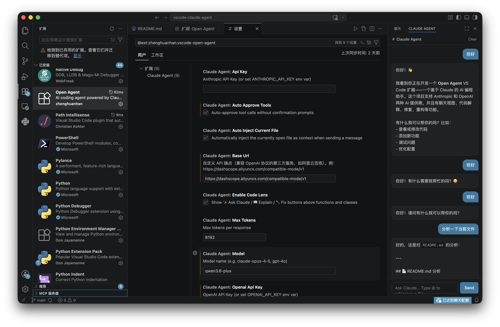
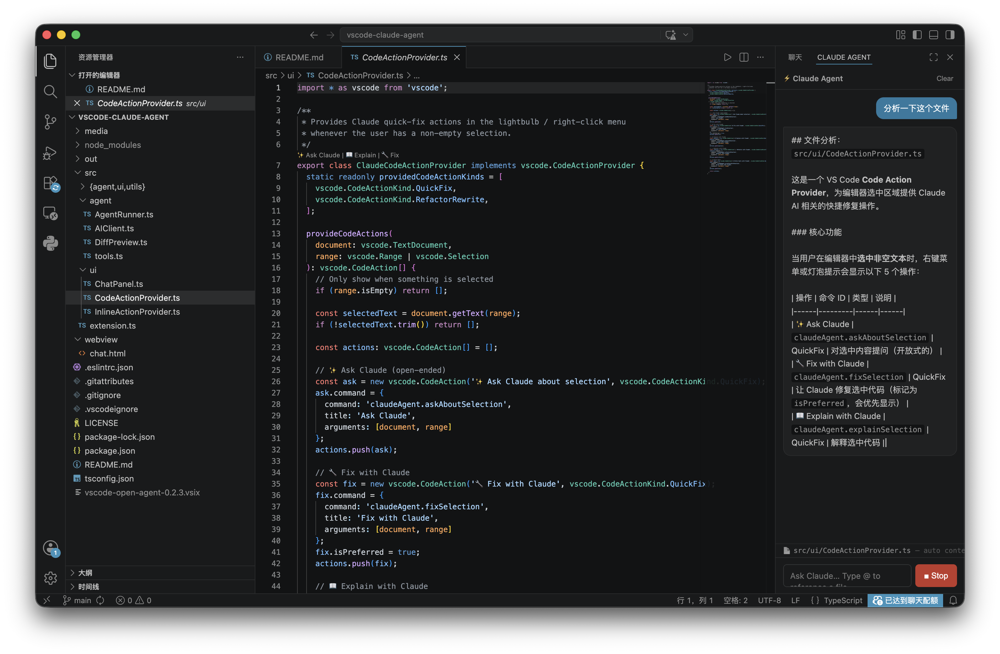
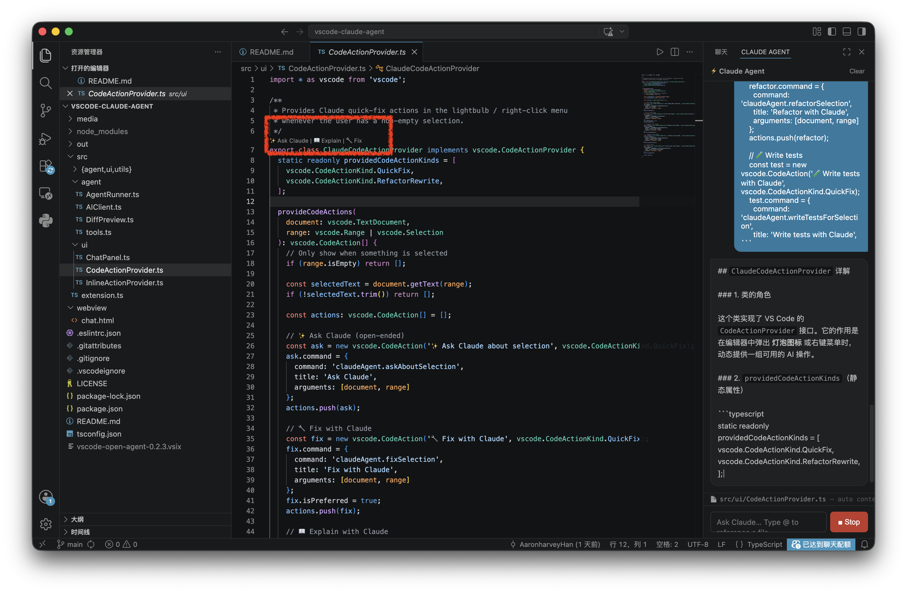

# Claude Agent — VS Code 扩展 v0.2.0

由 Anthropic Claude / OpenAI GPT 驱动，嵌入在 VS Code 中的 AI 编程助手。  
读取文件、编写代码、运行命令、提交更改、右键编辑——全部在聊天界面中完成。

## 功能特性

- **聊天侧边栏** — 持久化对话，保留完整上下文
- **多模型支持** — 支持 Anthropic Claude 和 OpenAI GPT 系列模型
- **智能体工具** — 自动读取/写入文件、运行 Shell 命令、使用 Git
- **工具审批** — 执行前审查并批准每次工具调用（可关闭）
- **编辑器集成** — 右键菜单：解释代码 / 修复代码 / 按指令编辑文件
- **Run Prompt** — 通过命令面板快速发送一次性指令
- **流式响应** — 实时 Token 流式输出




## 安装与设置

1. 安装扩展
2. 打开设置（`Cmd+,`）→ 搜索 `claudeAgent`
3. 选择 AI 提供商（`claudeAgent.provider`）：`anthropic` 或 `openai`
4. 设置对应提供商的 **API 密钥**  
   - Anthropic：`claudeAgent.apiKey` 或环境变量 `ANTHROPIC_API_KEY`
   - OpenAI：`claudeAgent.openaiApiKey` 或环境变量 `OPENAI_API_KEY`

## 配置项

| 配置项 | 默认值 | 说明 |
|---|---|---|
| `claudeAgent.provider` | `anthropic` | AI 提供商：`anthropic` 或 `openai` |
| `claudeAgent.apiKey` | `""` | Anthropic API 密钥 |
| `claudeAgent.openaiApiKey` | `""` | OpenAI API 密钥 |
| `claudeAgent.baseUrl` | `""` | 自定义 API 端点（兼容 OpenAI 协议的第三方服务，如阿里云百炼） |
| `claudeAgent.model` | `claude-opus-4-5` | 使用的模型（如 `claude-opus-4-5`、`gpt-4o`） |
| `claudeAgent.maxTokens` | `8192` | 每次响应的最大 Token 数 |
| `claudeAgent.autoApproveTools` | `false` | 自动批准工具调用，无需确认 |

## 智能体工具

| 工具 | 说明 |
|---|---|
| `read_file` | 读取工作区中的任意文件 |
| `write_file` | 创建或覆盖文件（需人工审批） |
| `apply_patch` | 应用统一差异补丁（unified diff，需人工审批） |
| `list_directory` | 浏览工作区目录结构 |
| `search_code` | 在代码库中进行全局搜索 |

## 命令

打开命令面板（`Cmd+Shift+P`）可快速调用：

| 命令 | 说明 |
|---|---|
| `Claude Agent: Open Chat` | 打开聊天面板 |
| `Claude Agent: Run Prompt...` | 发送一次性指令 |
| `Claude Agent: Explain Selection` | 解释所选代码（需先选中文本） |
| `Claude Agent: Fix Selection` | 修复所选代码（需先选中文本） |
| `Claude Agent: Edit File with Instruction...` | 按指令编辑当前文件 |

## 开发
### 构建 VSIX 包

```bash
nvm use 22  
npm install                
npm run compile
npm install -g @vscode/vsce
vsce package
```
### 问题反馈
zhenghuanhan@gmail.com
